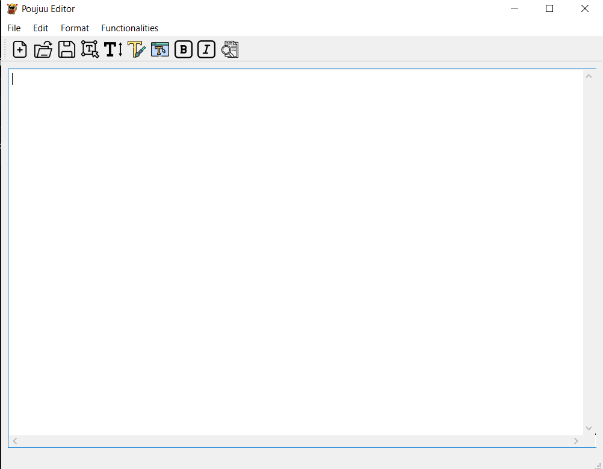
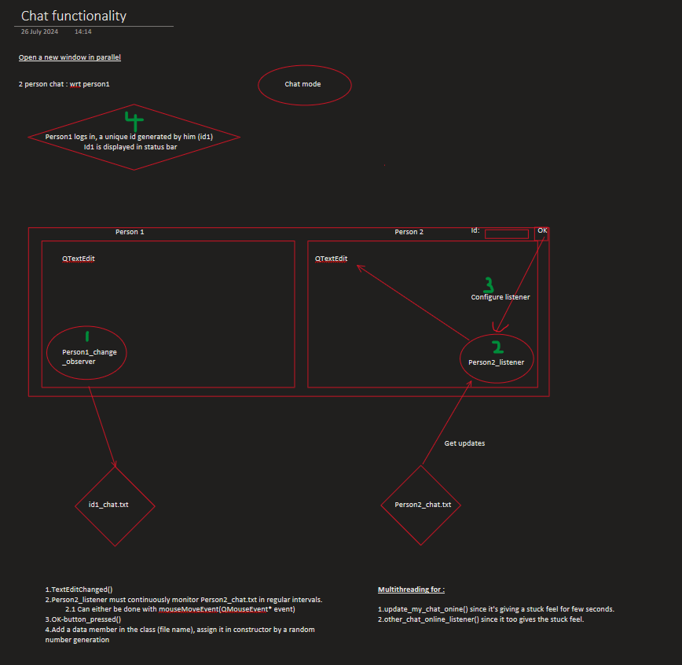
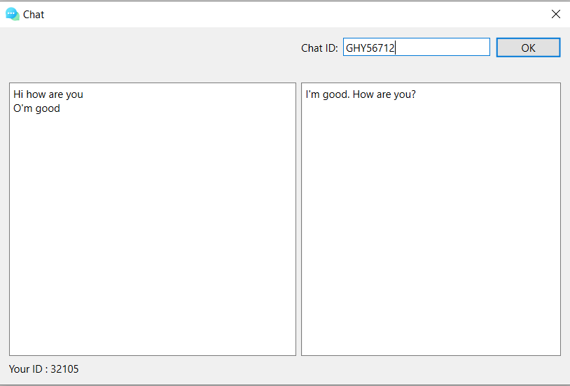

# Pouju-Editor
A basic text editor that supports fancy features like chat, teleprompting, etc

Overview:
The editor supports basic text editing including font formating, Editing, Saving, Opening New file, etc
To go for special features open the Feature Menu in the main window and you can select chatting or teleprompting

### Default View : 

### Chat Feature Design :

### Demo Chat Window : 

Edit the sample2.py file before initiating chatting. You will then be able to chat with the another user by entering their chatID that would be displayed in their orrsponding chat window
